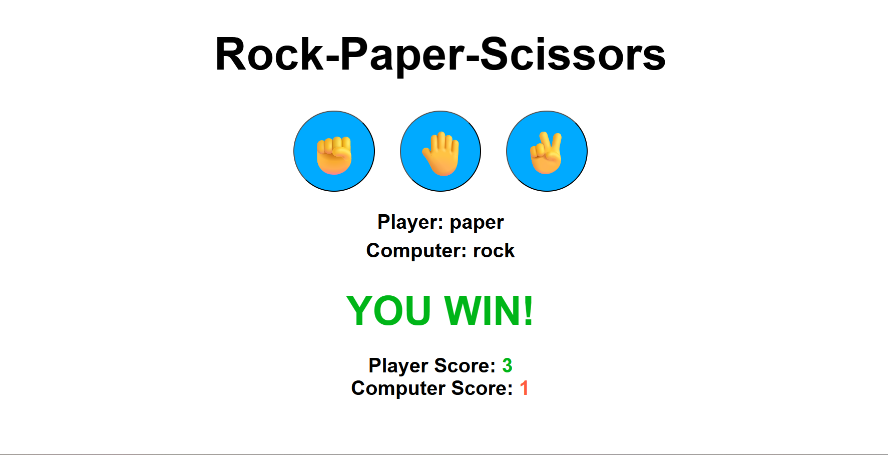
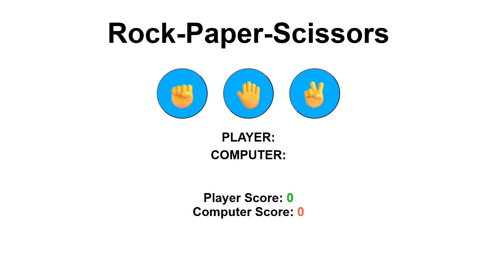
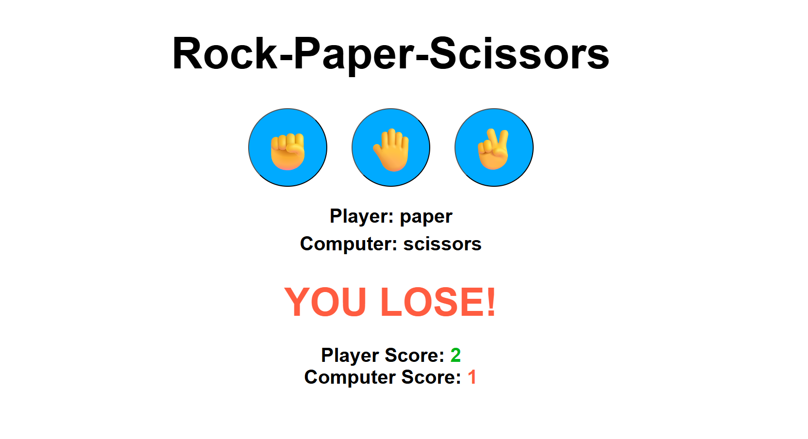
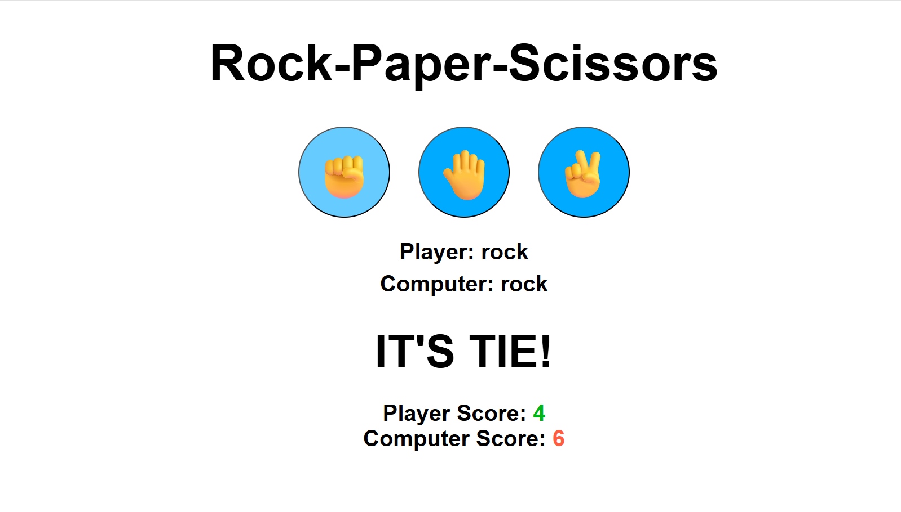

# Rock-Paper-Scissors Game 🪨📄✂️

A simple Rock-Paper-Scissors game built using HTML, CSS, and JavaScript. This classic game allows users to play against the computer, with a clean UI design.

## 🎮 Demo



## 🛠️ Technologies Used

- **HTML5** – Structure of the game
- **CSS3** – Styling and responsive design
- **JavaScript (ES6)** – Game logic and interactivity

## 🚀 Features

- Interactive UI
- Play against the computer
- Real-time result display
- Score tracking
- Basic animations

## 📸 Screenshots






## 🧠 How the Game Works

- User selects Rock, Paper, or Scissors.
- Computer makes a random choice.
- The winner is decided based on the classic rules:
  - Rock beats Scissors
  - Paper beats Rock
  - Scissors beats Paper
- Score updates based on the outcome.

## 📦 How to Run Locally

1. Clone the repository:
   ```bash
   git clone https://github.com/Nikunj-52147/game-Rock-Paper-Scissors.git
